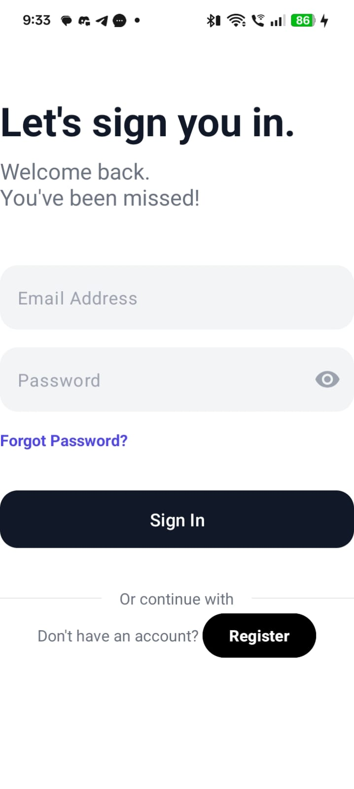
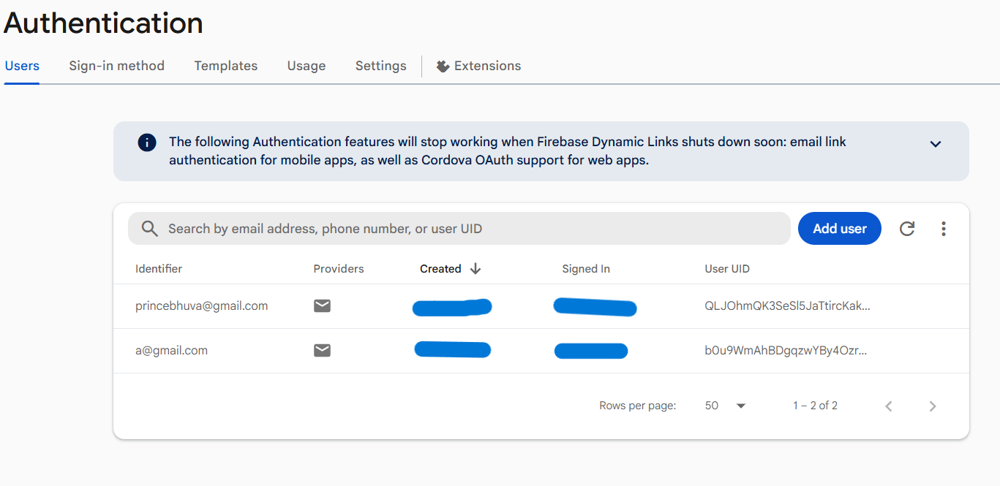
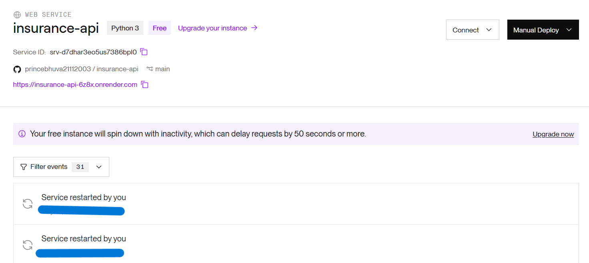
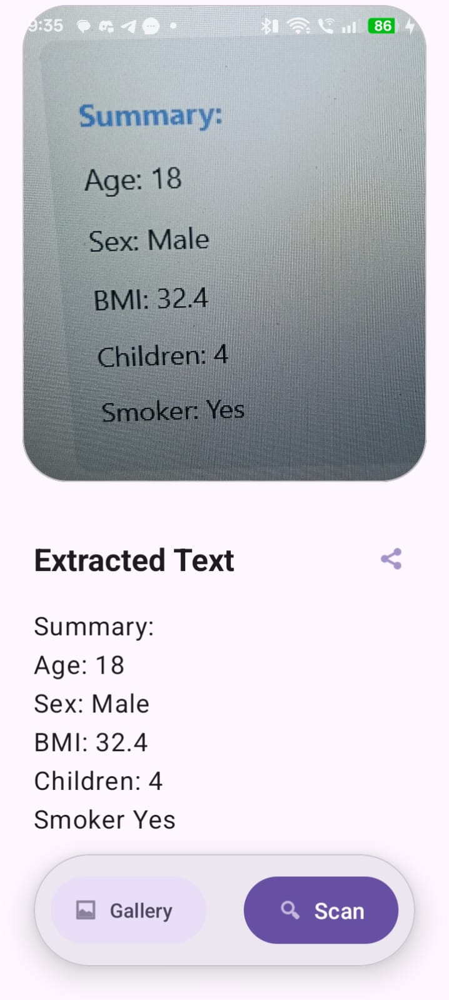
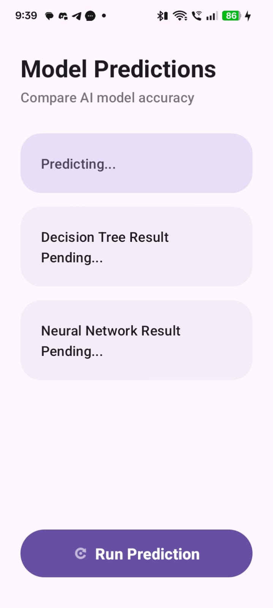
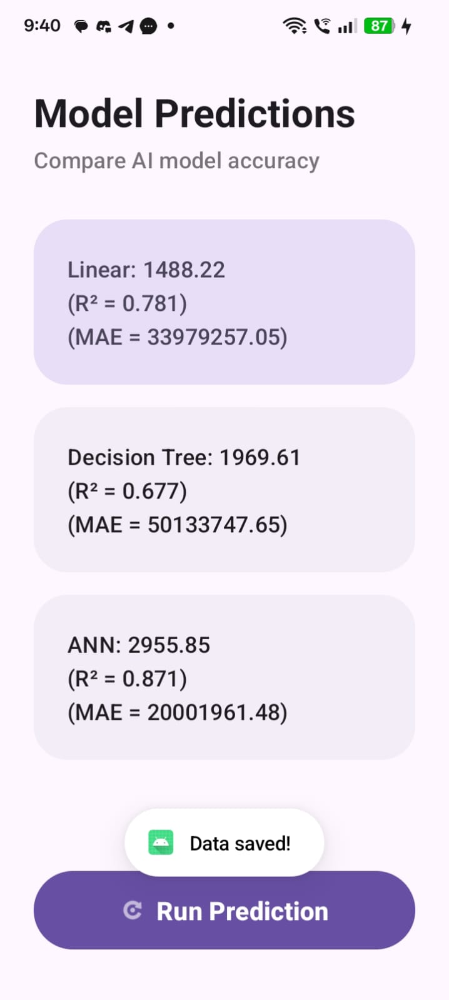
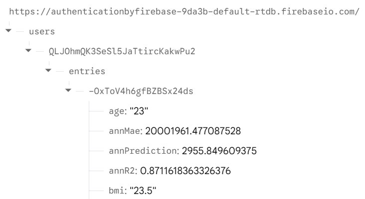
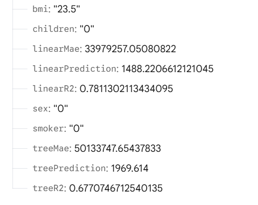

# 🏥 AI-Powered Insurance Prediction System

An end-to-end, full-stack Android application that predicts health insurance charges using machine learning. The system integrates a Python/Flask REST API hosting multiple ML models, Firebase for secure authentication and real-time data logging, and an Optical Character Recognition (OCR) engine for automated data entry.

## ✨ Key Features

* **Smart OCR Data Entry:** Users can snap a picture of a form or document. The app automatically extracts critical fields (Age, Sex, BMI, Children, Smoker status) and formats them for the prediction engine.
* **Triple-Model Machine Learning:** Sends user data to a cloud-hosted API that runs predictions simultaneously across three distinct trained models:
    * Linear Regression
    * Decision Tree
    * Artificial Neural Network (ANN)
* **Performance Metrics Transparency:** Displays not just the predicted cost, but the model evaluation metrics (R² Score and Mean Absolute Error) so users can compare model confidence.
* **Secure Authentication:** User registration and login flow powered by Firebase Authentication.
* **Cloud History Logging:** Every prediction and its associated inputs/outputs are saved to a Firebase Realtime Database tied to the user's unique ID for historical tracking.

## 🛠 Tech Stack

**Frontend (Mobile App)**
* **OS:** Android (Native)
* **UI/UX:** Material Design 3
* **Tools:** OCR Integration (for text extraction), Retrofit (for API calls)

**Backend (Machine Learning API)**
* **Framework:** Python / Flask
* **ML Libraries:** Scikit-Learn, PyTorch/TensorFlow (for ANN)
* **Hosting:** Deployed live on Render

**Cloud Services (Firebase)**
* **Auth:** Firebase Authentication (Email/Password)
* **Database:** Firebase Realtime Database (NoSQL)

---

## 📸 Application Workflow & Screenshots

### 1. Authentication & Cloud Setup
Users log in securely using Firebase Auth. The backend API is hosted on Render, ensuring 24/7 availability for the mobile client.

| Android Login | Firebase Auth Console | Render API Hosting |
| :---: | :---: | :---: |
|  |  |  |

### 2. OCR Data Extraction
Instead of typing, users can scan their details. The app parses the image and structures the data (Age, BMI, etc.) to send to the API.

| Extracted Data Summary |
| :---: |
|  |

### 3. Real-Time AI Predictions
The app pings the Flask backend, waits for the ML models to process the data, and displays the results side-by-side.

| Waiting for API | Final Model Predictions |
| :---: | :---: |
|  |  |

### 4. Cloud Data Logging
Once the prediction is complete, all inputs and outputs are instantly synced to the Firebase Realtime Database under the user's secure node.

| Firebase Realtime DB Logs |
| :---: |
|     |

---

## 🏗 System Architecture

1.  **Client:** The Android app collects data (via OCR or manual input).
2.  **Network:** App makes a `POST` request using Retrofit to the Flask API on Render.
3.  **Processing:** Flask feeds the parameters into the serialized `.pkl` / `.h5` ML models.
4.  **Response:** The API returns a JSON payload containing predictions, R² scores, and MAEs for all three models.
5.  **Storage:** The Android app receives the JSON, updates the UI, and pushes a complete record to the Firebase Realtime Database.
